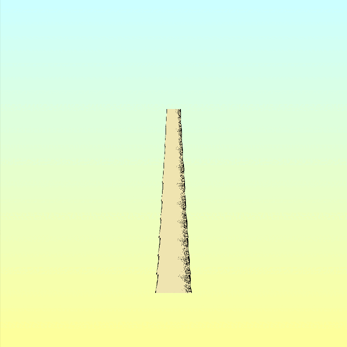

# Generative Tree Experimentation

Goals: 
* An algorithm that is based on the center of mass
* An algorithm that replicates growth and not just the simple addition of branches
* Interesting graphical rendering of trees
* Anything else of interest

Each interation is stored in the repo in full for interest sake to see how this project eveloves in complexity and to track the flow of ideas.

## Iteration 6

Image based design with nice gradient background.

